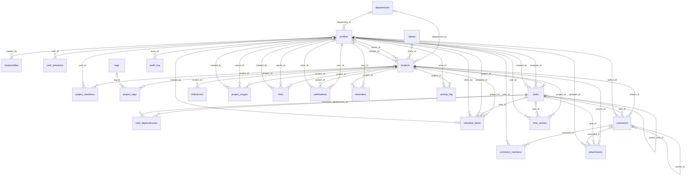

# Schema do banco · WebDash Grupo Moreno

> Documento gerado automaticamente por `npm run docs:schema`. Não edite à mão —
> a fonte é [`site/schema-data.js`](../site/schema-data.js).

**Motor:** Supabase (PostgreSQL 15+)  
**Migrations:** `supabase/migrations`

O banco tem **23 tabelas**, **16 views**, **26 functions** e **13 grupos de triggers**, com Row Level Security ativa em todas as tabelas.

## Sumário

- [Perfis de acesso](#perfis-de-acesso)
- [Diagrama de relacionamentos](#diagrama-de-relacionamentos)
- [Tabelas](#tabelas)
  - [Cadastros](#cadastros)
  - [Pessoas e acesso](#pessoas-e-acesso)
  - [Projetos](#projetos)
  - [Execução](#execucao)
  - [Colaboração](#colaboracao)
  - [Governança](#governanca)
- [Tipos enumerados](#tipos-enumerados)
- [Views](#views)
- [Functions](#functions)
- [Triggers](#triggers)
- [Realtime](#realtime)
- [Storage](#storage)

## Perfis de acesso

As permissões são aplicadas no banco por Row Level Security, não no frontend.

| Perfil | Alcance |
| ------ | ------- |
| **Administrador** | Acesso total. Único que exclui projetos e altera perfis de acesso. |
| **Analista** | Enxerga e gerencia todo o portfólio; lê a trilha de auditoria. É o perfil de quem se cadastra pela tela de criar conta. |
| **Líder** | Gerencia integralmente os projetos em que participa. |
| **Colaborador** | Enxerga apenas os projetos da sua equipe; edita as tarefas atribuídas a si ou criadas por si. |

## Diagrama de relacionamentos

## Tabelas

### Cadastros

_Estruturas de apoio compartilhadas pelo portfólio._

#### `departments`

Departamentos do Grupo Moreno. A cor alimenta os gráficos executivos. Administrador e analista cadastram um setor novo direto do formulário de projeto.

| Coluna | Tipo | Restrições | Referência | Observação |
| ------ | ---- | ---------- | ---------- | ---------- |
| `id` | `uuid` | PK | — | default `gen_random_uuid()`. Identificador. |
| `name` | `text` | NOT NULL | — | Nome do departamento (2 a 120 caracteres). |
| `code` | `text` | NOT NULL, UNIQUE | — | Sigla usada em códigos de projeto. |
| `color` | `text` | NOT NULL | — | default `'#1B3F94'`. Cor de identificação nos gráficos. |
| `is_active` | `boolean` | NOT NULL | — | default `true`. Desativa sem apagar histórico. |
| `created_at` | `timestamptz` | NOT NULL | — | default `now()` |
| `updated_at` | `timestamptz` | NOT NULL | — | default `now()`. Mantido por trigger. |

**RLS:** Leitura para todos os autenticados; escrita apenas para administrador e analista.

#### `responsibles`

Opções de responsável oferecidas no formulário de projeto — áreas como COA, Projetos, Actius e MAC, mais o que o time for cadastrando. É texto, e não referência a profiles, porque quem responde por um projeto nem sempre tem login.

| Coluna | Tipo | Restrições | Referência | Observação |
| ------ | ---- | ---------- | ---------- | ---------- |
| `id` | `uuid` | PK | — | default `gen_random_uuid()` |
| `name` | `text` | NOT NULL, UNIQUE | — | De 2 a 80 caracteres. |
| `created_by` | `uuid` | FK | `profiles(id)` ON DELETE SET NULL | — |
| `created_at` | `timestamptz` | NOT NULL | — | default `now()` |

**RLS:** Igual às tags: leitura para todos os autenticados, qualquer um acrescenta uma opção, e mexer no catálogo é de administrador e analista.

#### `clients`

Clientes internos e externos vinculados aos projetos.

| Coluna | Tipo | Restrições | Referência | Observação |
| ------ | ---- | ---------- | ---------- | ---------- |
| `id` | `uuid` | PK | — | default `gen_random_uuid()` |
| `name` | `text` | NOT NULL | — | Razão social ou nome fantasia. |
| `code` | `text` | UNIQUE | — | Código interno. |
| `contact_name` | `text` | — | — | — |
| `contact_email` | `text` | — | — | Validado por CHECK de formato de e-mail. |
| `phone` | `text` | — | — | — |
| `is_active` | `boolean` | NOT NULL | — | default `true` |
| `created_at` | `timestamptz` | NOT NULL | — | default `now()` |
| `updated_at` | `timestamptz` | NOT NULL | — | default `now()` |

**RLS:** Leitura para todos os autenticados; escrita apenas para administrador e analista.

#### `tags`

Etiquetas livres para classificar projetos.

| Coluna | Tipo | Restrições | Referência | Observação |
| ------ | ---- | ---------- | ---------- | ---------- |
| `id` | `uuid` | PK | — | default `gen_random_uuid()` |
| `name` | `text` | NOT NULL, UNIQUE | — | — |
| `color` | `text` | NOT NULL | — | default `'#8CC63F'` |
| `created_at` | `timestamptz` | NOT NULL | — | default `now()` |

**RLS:** Leitura para todos; qualquer autenticado pode criar; edição restrita à gestão.

### Pessoas e acesso

_Perfis, equipe e presença._

#### `profiles`

Espelho de auth.users criado automaticamente no cadastro. O primeiro usuário da instância vira administrador.

| Coluna | Tipo | Restrições | Referência | Observação |
| ------ | ---- | ---------- | ---------- | ---------- |
| `id` | `uuid` | PK, FK | `auth.users(id)` ON DELETE CASCADE | — |
| `email` | `text` | NOT NULL | — | — |
| `full_name` | `text` | NOT NULL | — | default `''` |
| `avatar_url` | `text` | — | — | Aponta para o bucket público avatars. |
| `job_title` | `text` | — | — | — |
| `phone` | `text` | — | — | — |
| `role` | `app_role` | NOT NULL | — | default `'analista'`. Determina todo o alcance da RLS. Conta nova nasce analista; o primeiro usuário vira administrador. |
| `department_id` | `uuid` | FK | `departments(id)` ON DELETE SET NULL | — |
| `weekly_capacity_hours` | `numeric(5,2)` | NOT NULL | — | default `40`. Base do cálculo de workload (0 a 80). |
| `is_active` | `boolean` | NOT NULL | — | default `true` |
| `last_seen_at` | `timestamptz` | — | — | Atualizado pelo heartbeat de presença. |
| `created_at` | `timestamptz` | NOT NULL | — | default `now()` |
| `updated_at` | `timestamptz` | NOT NULL | — | default `now()` |

**Índices e restrições:** `idx_profiles_department`, `idx_profiles_role`, `idx_profiles_name_trgm (GIN/trigram para busca)`

**RLS:** Todos leem (necessário para menções e responsáveis). Cada um edita o próprio registro, sem poder mudar o próprio papel. Administrador edita qualquer um.

#### `user_presence`

Registro de presença alimentado pela RPC heartbeat(); base do indicador "usuários online".

| Coluna | Tipo | Restrições | Referência | Observação |
| ------ | ---- | ---------- | ---------- | ---------- |
| `user_id` | `uuid` | PK, FK | `profiles(id)` ON DELETE CASCADE | — |
| `status` | `text` | NOT NULL | — | default `'online'` |
| `last_ping` | `timestamptz` | NOT NULL | — | default `now()` |

**RLS:** Todos leem; cada usuário só escreve a própria linha.

### Projetos

_Núcleo do portfólio._

#### `projects`

Núcleo do portfólio. progress e health são calculados por trigger a partir das tarefas e do cronograma — não devem ser escritos manualmente.

| Coluna | Tipo | Restrições | Referência | Observação |
| ------ | ---- | ---------- | ---------- | ---------- |
| `id` | `uuid` | PK | — | default `gen_random_uuid()` |
| `code` | `text` | NOT NULL, UNIQUE | — | Código público, ex.: PRJ-001. |
| `name` | `text` | NOT NULL | — | — |
| `description` | `text` | — | — | — |
| `department_id` | `uuid` | FK | `departments(id)` ON DELETE SET NULL | — |
| `client_id` | `uuid` | FK | `clients(id)` ON DELETE SET NULL | — |
| `owner_id` | `uuid` | FK | `profiles(id)` ON DELETE SET NULL | Dono no sistema — é dele que a RLS tira quem pode editar o projeto. |
| `responsibles` | `text[]` | NOT NULL | — | default `'{}'`. Áreas e/ou pessoas que respondem pelo projeto, até 12. As opções ficam na tabela responsibles. |
| `status` | `project_status` | NOT NULL | — | default `'backlog'` |
| `priority` | `priority_level` | NOT NULL | — | default `'media'` |
| `complexity` | `complexity_level` | NOT NULL | — | default `'media'` |
| `category` | `text` | — | — | — |
| `health` | `health_status` | NOT NULL, CALCULADO | — | default `'no_prazo'`. Derivado por calc_health() no trigger project_intelligence. |
| `start_date` | `date` | NOT NULL | — | default `current_date` |
| `due_date` | `date` | NOT NULL | — | CHECK garante due_date >= start_date. |
| `actual_start_date` | `date` | CALCULADO | — | Preenchido quando o projeto sai do backlog ou de não iniciado. |
| `actual_end_date` | `date` | CALCULADO | — | Preenchido ao concluir. |
| `budget` | `numeric(14,2)` | NOT NULL | — | default `0` |
| `cost` | `numeric(14,2)` | NOT NULL | — | default `0` |
| `expected_return` | `numeric(14,2)` | NOT NULL | — | default `0`. Retorno financeiro esperado no horizonte de return_period_months. Base do ROI e do payback. |
| `actual_return` | `numeric(14,2)` | NOT NULL | — | default `0`. Retorno já realizado e comprovado. |
| `return_period_months` | `integer` | NOT NULL | — | default `12`. Horizonte do retorno, de 1 a 240 meses. |
| `financial_notes` | `text` | — | — | Premissas da viabilidade: de onde vem o retorno e como será medido. |
| `planned_hours` | `numeric(10,2)` | NOT NULL | — | default `0`. Estimativa macro; as horas por tarefa ficam em tasks. |
| `progress` | `numeric(5,2)` | NOT NULL, CALCULADO | — | default `0`. Recalculado por recalc_project_progress(), ponderado por horas estimadas. |
| `position` | `integer` | NOT NULL | — | default `0` |
| `is_archived` | `boolean` | NOT NULL | — | default `false` |
| `created_by` | `uuid` | FK | `profiles(id)` ON DELETE SET NULL | — |
| `created_at` | `timestamptz` | NOT NULL | — | default `now()` |
| `updated_at` | `timestamptz` | NOT NULL | — | default `now()` |

**Índices e restrições:** `idx_projects_status (parcial, is_archived = false)`, `idx_projects_owner`, `idx_projects_department`, `idx_projects_client`, `idx_projects_due_date`, `idx_projects_health`, `idx_projects_name_trgm (GIN/trigram para busca)`, `idx_projects_responsibles (GIN sobre o array de responsáveis)`

**RLS:** Enxergam: administrador, analista, dono, criador e membros da equipe. Criam: administrador, analista e líder. Editam: gestão, dono ou líder membro. Excluem: apenas administrador.

#### `project_members`

Equipe do projeto. É esta tabela que abre o acesso do colaborador via RLS.

| Coluna | Tipo | Restrições | Referência | Observação |
| ------ | ---- | ---------- | ---------- | ---------- |
| `project_id` | `uuid` | PK, FK | `projects(id)` ON DELETE CASCADE | — |
| `user_id` | `uuid` | PK, FK | `profiles(id)` ON DELETE CASCADE | — |
| `role_in_project` | `text` | NOT NULL | — | default `'membro'`. Papel livre: gestor, analista, etc. |
| `allocation_percent` | `numeric(5,2)` | NOT NULL | — | default `100`. Percentual de alocação (0 a 100). |
| `added_at` | `timestamptz` | NOT NULL | — | default `now()` |

**RLS:** Membros e gestão leem; apenas quem gerencia o projeto altera.

#### `project_tags`

Relacionamento N:N entre projetos e tags.

| Coluna | Tipo | Restrições | Referência | Observação |
| ------ | ---- | ---------- | ---------- | ---------- |
| `project_id` | `uuid` | PK, FK | `projects(id)` ON DELETE CASCADE | — |
| `tag_id` | `uuid` | PK, FK | `tags(id)` ON DELETE CASCADE | — |

**RLS:** Leitura para quem enxerga o projeto; escrita para quem o gerencia.

### Execução

_Tarefas, cronograma, checklist e marcos._

#### `tasks`

Tarefas do projeto, com suporte a subtarefas via parent_task_id. Alterar datas dispara o recálculo das sucessoras.

| Coluna | Tipo | Restrições | Referência | Observação |
| ------ | ---- | ---------- | ---------- | ---------- |
| `id` | `uuid` | PK | — | default `gen_random_uuid()` |
| `project_id` | `uuid` | NOT NULL, FK | `projects(id)` ON DELETE CASCADE | — |
| `parent_task_id` | `uuid` | FK | `tasks(id)` ON DELETE CASCADE | Subtarefa. Só as raízes entram no cálculo de progresso. |
| `code` | `text` | — | — | — |
| `title` | `text` | NOT NULL | — | — |
| `description` | `text` | — | — | — |
| `status` | `task_status` | NOT NULL | — | default `'backlog'`. Coluna do Kanban. |
| `priority` | `priority_level` | NOT NULL | — | default `'media'` |
| `assignee_id` | `uuid` | FK | `profiles(id)` ON DELETE SET NULL | — |
| `start_date` | `date` | — | — | — |
| `due_date` | `date` | — | — | CHECK garante due_date >= start_date. |
| `completed_at` | `timestamptz` | CALCULADO | — | Preenchido/limpo conforme o status. |
| `estimated_hours` | `numeric(8,2)` | NOT NULL | — | default `0`. Peso no progresso do projeto e no workload. |
| `progress` | `numeric(5,2)` | NOT NULL | — | default `0`. Forçado a 100 quando concluída. |
| `position` | `integer` | NOT NULL | — | default `0`. Ordem dentro da coluna do Kanban. |
| `is_milestone` | `boolean` | NOT NULL | — | default `false` |
| `created_by` | `uuid` | FK | `profiles(id)` ON DELETE SET NULL | — |
| `created_at` | `timestamptz` | NOT NULL | — | default `now()` |
| `updated_at` | `timestamptz` | NOT NULL | — | default `now()` |

**Índices e restrições:** `idx_tasks_project`, `idx_tasks_assignee`, `idx_tasks_status (project_id, status, position)`, `idx_tasks_due_date`, `idx_tasks_parent`, `idx_tasks_title_trgm (GIN/trigram)`

**RLS:** Leitura para quem enxerga o projeto. Qualquer membro cria. Edita quem gerencia o projeto, o responsável pela tarefa ou quem a criou.

#### `task_dependencies`

Arestas do grafo de dependências. Base do recálculo de cronograma e do caminho crítico.

| Coluna | Tipo | Restrições | Referência | Observação |
| ------ | ---- | ---------- | ---------- | ---------- |
| `id` | `uuid` | PK | — | default `gen_random_uuid()` |
| `predecessor_id` | `uuid` | NOT NULL, FK | `tasks(id)` ON DELETE CASCADE | — |
| `successor_id` | `uuid` | NOT NULL, FK | `tasks(id)` ON DELETE CASCADE | — |
| `type` | `dependency_type` | NOT NULL | — | default `'FS'` |
| `lag_days` | `integer` | NOT NULL | — | default `0`. Folga aplicada ao empurrar a sucessora. |
| `created_at` | `timestamptz` | NOT NULL | — | default `now()` |

**Índices e restrições:** `UNIQUE (predecessor_id, successor_id)`, `CHECK predecessor_id <> successor_id`, `idx_task_dep_successor`

**RLS:** Leitura para quem enxerga o projeto; escrita para quem o gerencia.

#### `checklist_items`

Itens de checklist. Pertencem ao projeto e, opcionalmente, a uma tarefa específica.

| Coluna | Tipo | Restrições | Referência | Observação |
| ------ | ---- | ---------- | ---------- | ---------- |
| `id` | `uuid` | PK | — | default `gen_random_uuid()` |
| `project_id` | `uuid` | NOT NULL, FK | `projects(id)` ON DELETE CASCADE | — |
| `task_id` | `uuid` | FK | `tasks(id)` ON DELETE CASCADE | NULL = checklist do projeto. |
| `title` | `text` | NOT NULL | — | — |
| `is_done` | `boolean` | NOT NULL | — | default `false` |
| `assignee_id` | `uuid` | FK | `profiles(id)` ON DELETE SET NULL | — |
| `due_date` | `date` | — | — | — |
| `position` | `integer` | NOT NULL | — | default `0` |
| `done_at` | `timestamptz` | CALCULADO | — | Carimbado pelo trigger checklist_done. |
| `done_by` | `uuid` | FK, CALCULADO | `profiles(id)` ON DELETE SET NULL | — |
| `created_by` | `uuid` | FK | `profiles(id)` ON DELETE SET NULL | — |
| `created_at` | `timestamptz` | NOT NULL | — | default `now()` |
| `updated_at` | `timestamptz` | NOT NULL | — | default `now()` |

**RLS:** Qualquer pessoa que enxergue o projeto pode ler e escrever.

#### `milestones`

Marcos do projeto, exibidos no roadmap executivo e na timeline.

| Coluna | Tipo | Restrições | Referência | Observação |
| ------ | ---- | ---------- | ---------- | ---------- |
| `id` | `uuid` | PK | — | default `gen_random_uuid()` |
| `project_id` | `uuid` | NOT NULL, FK | `projects(id)` ON DELETE CASCADE | — |
| `name` | `text` | NOT NULL | — | — |
| `description` | `text` | — | — | — |
| `due_date` | `date` | NOT NULL | — | — |
| `area` | `project_area` | — | — | Área da Diretoria: agrícola, administrativo ou industrial. Nula enquanto não classificada. |
| `diretoria_aprovacao` | `approval_status` | NOT NULL | — | default `'em_aprovacao'`. Aprovação da Diretoria: sim, não ou em aprovação. |
| `redmine_lancado` | `boolean` | NOT NULL | — | default `false`. Se o projeto/ação já foi lançado no Redmine. |
| `aderencia_prazo` | `date` | — | — | Data prevista para medir a aderência depois da implantação. |
| `melhoria_continua` | `improvement_status` | NOT NULL | — | default `'em_avaliacao'`. Se a ação entra na Melhoria Contínua: sim, não ou em avaliação. |
| `prazo_a_definir` | `boolean` | NOT NULL | — | default `false`. Prazo herdado, ainda não repactuado. A data em due_date continua guardada; enquanto isto for verdadeiro a tela mostra "A definir", a saúde vira no_prazo e o projeto sai da conta de atrasados. |
| `status` | `milestone_status` | NOT NULL | — | default `'pendente'` |
| `completed_at` | `timestamptz` | — | — | — |
| `created_at` | `timestamptz` | NOT NULL | — | default `now()` |
| `updated_at` | `timestamptz` | NOT NULL | — | default `now()` |

**RLS:** Leitura para quem enxerga o projeto; escrita para quem o gerencia.

#### `project_stages`

Etapas (fases) do projeto. Guardam início e término planejados, datas reais, percentual de avanço e o texto de andamento escrito pelo responsável. Alimentam o organograma de etapas e a linha do tempo.

| Coluna | Tipo | Restrições | Referência | Observação |
| ------ | ---- | ---------- | ---------- | ---------- |
| `id` | `uuid` | PK | — | default `gen_random_uuid()` |
| `project_id` | `uuid` | NOT NULL, FK | `projects(id)` ON DELETE CASCADE | — |
| `name` | `text` | NOT NULL | — | De 2 a 160 caracteres. |
| `description` | `text` | — | — | O que a etapa entrega. |
| `progress_notes` | `text` | — | — | Andamento: o que já foi feito, o que está em curso e o que trava. |
| `status` | `stage_status` | NOT NULL | — | default `'nao_iniciada'` |
| `owner_id` | `uuid` | FK | `profiles(id)` ON DELETE SET NULL | Responsável — pode registrar o andamento mesmo sem gerenciar o projeto. |
| `start_date` | `date` | NOT NULL | — | default `current_date`. Início planejado. |
| `end_date` | `date` | NOT NULL | — | CHECK garante end_date >= start_date. |
| `actual_start_date` | `date` | CALCULADO | — | Carimbado quando a etapa entra em andamento. |
| `actual_end_date` | `date` | CALCULADO | — | Carimbado ao concluir; limpo se a etapa for reaberta. |
| `progress` | `numeric(5,2)` | NOT NULL | — | default `0`. Forçado a 100 quando concluída e a 0 quando não iniciada. |
| `weight` | `numeric(6,2)` | NOT NULL | — | default `1`. Peso da etapa no avanço consolidado do projeto. |
| `position` | `integer` | NOT NULL | — | default `0`. Ordem no organograma; preenchida sozinha na inclusão. |
| `created_by` | `uuid` | FK | `profiles(id)` ON DELETE SET NULL | Autor do cadastro — pode excluir a própria etapa. |
| `created_at` | `timestamptz` | NOT NULL | — | default `now()` |
| `updated_at` | `timestamptz` | NOT NULL | — | default `now()` |

**Índices e restrições:** `idx_project_stages_project (project_id, position)`, `idx_project_stages_owner`, `idx_project_stages_dates`

**RLS:** Leitura para quem enxerga o projeto. Cria quem gerencia o projeto. Exclui quem gerencia o projeto ou quem cadastrou a etapa. Edita quem gerencia ou o responsável pela etapa.

### Colaboração

_Comentários, menções e arquivos._

#### `comments`

Chat do projeto ou da tarefa, com suporte a respostas encadeadas.

| Coluna | Tipo | Restrições | Referência | Observação |
| ------ | ---- | ---------- | ---------- | ---------- |
| `id` | `uuid` | PK | — | default `gen_random_uuid()` |
| `project_id` | `uuid` | NOT NULL, FK | `projects(id)` ON DELETE CASCADE | — |
| `task_id` | `uuid` | FK | `tasks(id)` ON DELETE CASCADE | NULL = discussão do projeto. |
| `parent_id` | `uuid` | FK | `comments(id)` ON DELETE CASCADE | — |
| `author_id` | `uuid` | NOT NULL, FK | `profiles(id)` ON DELETE CASCADE | — |
| `body` | `text` | NOT NULL | — | CHECK impede corpo vazio. |
| `edited_at` | `timestamptz` | — | — | — |
| `created_at` | `timestamptz` | NOT NULL | — | default `now()` |

**Índices e restrições:** `idx_comments_project`, `idx_comments_task`, `idx_comments_body_trgm (GIN/trigram)`

**RLS:** Leitura para quem enxerga o projeto. Escreve em nome próprio. Exclui o autor ou quem gerencia o projeto.

#### `comment_mentions`

Menções @nome extraídas do comentário. Inserir aqui dispara a notificação.

| Coluna | Tipo | Restrições | Referência | Observação |
| ------ | ---- | ---------- | ---------- | ---------- |
| `comment_id` | `uuid` | PK, FK | `comments(id)` ON DELETE CASCADE | — |
| `user_id` | `uuid` | PK, FK | `profiles(id)` ON DELETE CASCADE | — |

**RLS:** Lê o mencionado e quem enxerga o projeto; só o autor do comentário insere.

#### `attachments`

Metadados dos arquivos no Supabase Storage. O caminho segue project-files/{project_id}/{uuid}-{arquivo}, convenção exigida pelas policies do bucket.

| Coluna | Tipo | Restrições | Referência | Observação |
| ------ | ---- | ---------- | ---------- | ---------- |
| `id` | `uuid` | PK | — | default `gen_random_uuid()` |
| `project_id` | `uuid` | NOT NULL, FK | `projects(id)` ON DELETE CASCADE | — |
| `task_id` | `uuid` | FK | `tasks(id)` ON DELETE CASCADE | — |
| `comment_id` | `uuid` | FK | `comments(id)` ON DELETE CASCADE | — |
| `uploader_id` | `uuid` | FK | `profiles(id)` ON DELETE SET NULL | — |
| `bucket_id` | `text` | NOT NULL | — | default `'project-files'` |
| `storage_path` | `text` | NOT NULL | — | UNIQUE junto com bucket_id. |
| `file_name` | `text` | NOT NULL | — | — |
| `mime_type` | `text` | — | — | — |
| `size_bytes` | `bigint` | NOT NULL | — | default `0` |
| `created_at` | `timestamptz` | NOT NULL | — | default `now()` |

**RLS:** Leitura para quem enxerga o projeto. Envia em nome próprio. Exclui quem enviou ou quem gerencia o projeto.

### Governança

_Riscos, horas, auditoria e atividades._

#### `risks`

Riscos do projeto. severity é coluna gerada (probabilidade × impacto) e alimenta o heatmap 5×5.

| Coluna | Tipo | Restrições | Referência | Observação |
| ------ | ---- | ---------- | ---------- | ---------- |
| `id` | `uuid` | PK | — | default `gen_random_uuid()` |
| `project_id` | `uuid` | NOT NULL, FK | `projects(id)` ON DELETE CASCADE | — |
| `title` | `text` | NOT NULL | — | — |
| `description` | `text` | — | — | — |
| `probability` | `smallint` | NOT NULL | — | default `3`. Escala de 1 a 5. |
| `impact` | `smallint` | NOT NULL | — | default `3`. Escala de 1 a 5. |
| `severity` | `smallint` | GENERATED | — | GENERATED ALWAYS AS (probability * impact) STORED. |
| `status` | `risk_status` | NOT NULL | — | default `'identificado'` |
| `mitigation` | `text` | — | — | — |
| `owner_id` | `uuid` | FK | `profiles(id)` ON DELETE SET NULL | — |
| `due_date` | `date` | — | — | — |
| `created_by` | `uuid` | FK | `profiles(id)` ON DELETE SET NULL | — |
| `created_at` | `timestamptz` | NOT NULL | — | default `now()` |
| `updated_at` | `timestamptz` | NOT NULL | — | default `now()` |

**Índices e restrições:** `idx_risks_project`, `idx_risks_severity (DESC)`

**RLS:** Leitura para quem enxerga o projeto; escrita para quem o gerencia ou para quem registrou o risco.

#### `time_entries`

Apontamento de horas. Base da eficiência (estimado ÷ apontado) e do workload realizado.

| Coluna | Tipo | Restrições | Referência | Observação |
| ------ | ---- | ---------- | ---------- | ---------- |
| `id` | `uuid` | PK | — | default `gen_random_uuid()` |
| `project_id` | `uuid` | NOT NULL, FK | `projects(id)` ON DELETE CASCADE | — |
| `task_id` | `uuid` | FK | `tasks(id)` ON DELETE SET NULL | — |
| `user_id` | `uuid` | NOT NULL, FK | `profiles(id)` ON DELETE CASCADE | — |
| `work_date` | `date` | NOT NULL | — | default `current_date` |
| `hours` | `numeric(6,2)` | NOT NULL | — | CHECK: maior que 0 e no máximo 24. |
| `description` | `text` | — | — | — |
| `created_at` | `timestamptz` | NOT NULL | — | default `now()` |
| `updated_at` | `timestamptz` | NOT NULL | — | default `now()` |

**RLS:** Lê o autor e quem enxerga o projeto. Aponta em nome próprio. Edita/exclui o autor ou a gestão do projeto.

#### `notifications`

Notificações pessoais criadas por trigger e entregues via Realtime. Nunca notificam quem originou a ação.

| Coluna | Tipo | Restrições | Referência | Observação |
| ------ | ---- | ---------- | ---------- | ---------- |
| `id` | `uuid` | PK | — | default `gen_random_uuid()` |
| `user_id` | `uuid` | NOT NULL, FK | `profiles(id)` ON DELETE CASCADE | — |
| `type` | `notification_type` | NOT NULL | — | default `'sistema'` |
| `title` | `text` | NOT NULL | — | — |
| `body` | `text` | — | — | — |
| `project_id` | `uuid` | FK | `projects(id)` ON DELETE CASCADE | — |
| `entity_type` | `text` | — | — | project ou task, para montar o link de destino. |
| `entity_id` | `uuid` | — | — | — |
| `actor_id` | `uuid` | FK | `profiles(id)` ON DELETE SET NULL | — |
| `is_read` | `boolean` | NOT NULL | — | default `false` |
| `read_at` | `timestamptz` | — | — | — |
| `created_at` | `timestamptz` | NOT NULL | — | default `now()` |

**Índices e restrições:** `idx_notifications_user (user_id, is_read, created_at DESC)`

**RLS:** Estritamente pessoal: cada usuário lê, marca como lida e apaga apenas as próprias. A escrita ocorre por funções SECURITY DEFINER.

#### `reminders`

Lembretes programados pela própria pessoa: hora marcada, repetição opcional e aviso pelo navegador. Diferente das notificações, que nascem de regra no banco. A hora fica aqui, e não num timer do navegador, para o lembrete sobreviver a recarregar a página e a trocar de máquina.

| Coluna | Tipo | Restrições | Referência | Observação |
| ------ | ---- | ---------- | ---------- | ---------- |
| `id` | `uuid` | PK | — | default `gen_random_uuid()` |
| `user_id` | `uuid` | NOT NULL, FK | `profiles(id)` ON DELETE CASCADE | — |
| `project_id` | `uuid` | FK | `projects(id)` ON DELETE CASCADE | — |
| `title` | `text` | NOT NULL | — | Entre 2 e 120 caracteres. |
| `body` | `text` | — | — | — |
| `next_at` | `timestamptz` | NOT NULL | — | Quando avisar da próxima vez. |
| `repeat_minutes` | `integer` | — | — | Minutos entre um aviso e o seguinte; nulo avisa uma vez só. Mínimo de 5. |
| `is_active` | `boolean` | NOT NULL | — | default `true` |
| `last_fired_at` | `timestamptz` | — | — | — |
| `created_at` | `timestamptz` | NOT NULL | — | default `now()` |

**Índices e restrições:** `idx_reminders_due (user_id, is_active, next_at)`

**RLS:** Estritamente pessoal: cada usuário lê, cria, edita e apaga apenas os próprios lembretes.

#### `activity_log`

Centro de atividades: histórico legível do que a equipe fez, transmitido em tempo real.

| Coluna | Tipo | Restrições | Referência | Observação |
| ------ | ---- | ---------- | ---------- | ---------- |
| `id` | `uuid` | PK | — | default `gen_random_uuid()` |
| `project_id` | `uuid` | FK | `projects(id)` ON DELETE CASCADE | — |
| `actor_id` | `uuid` | FK | `profiles(id)` ON DELETE SET NULL | — |
| `action` | `text` | NOT NULL | — | criou, atualizou, moveu, comentou. |
| `entity_type` | `text` | NOT NULL | — | — |
| `entity_id` | `uuid` | — | — | — |
| `summary` | `text` | NOT NULL | — | Frase pronta para exibição. |
| `metadata` | `jsonb` | NOT NULL | — | default `'{}'` |
| `created_at` | `timestamptz` | NOT NULL | — | default `now()` |

**RLS:** Somente leitura para o cliente, limitada aos projetos visíveis. Escrita apenas por log_activity() (SECURITY DEFINER).

#### `audit_log`

Trilha de auditoria preenchida por trigger genérico em projects, tasks, project_members, checklist_items, milestones, risks, time_entries, attachments e profiles.

| Coluna | Tipo | Restrições | Referência | Observação |
| ------ | ---- | ---------- | ---------- | ---------- |
| `id` | `bigint` | PK | — | default `GENERATED ALWAYS AS IDENTITY` |
| `table_name` | `text` | NOT NULL | — | — |
| `record_id` | `uuid` | — | — | — |
| `action` | `audit_action` | NOT NULL | — | — |
| `actor_id` | `uuid` | FK | `profiles(id)` ON DELETE SET NULL | Quem alterou. |
| `old_data` | `jsonb` | — | — | Valor antigo do registro completo. |
| `new_data` | `jsonb` | — | — | Valor novo do registro completo. |
| `changed_fields` | `text[]` | — | — | Apenas os campos que realmente mudaram (updated_at é ignorado). |
| `created_at` | `timestamptz` | NOT NULL | — | default `now()` |

**Índices e restrições:** `idx_audit_record (table_name, record_id, created_at DESC)`, `idx_audit_actor`

**RLS:** Somente leitura, restrita a administrador e analista. Escrita apenas pelo trigger tg_audit() (SECURITY DEFINER).

## Tipos enumerados

| Tipo | Valores | Uso |
| ---- | ------- | --- |
| `app_role` | `administrador`, `analista`, `lider`, `colaborador` | Perfis de acesso da plataforma, base de toda a RLS. |
| `project_status` | `nao_iniciado`, `backlog`, `planejamento`, `em_desenvolvimento`, `homologacao`, `pausado`, `concluido`, `cancelado` | Situação do projeto no funil corporativo. |
| `task_status` | `backlog`, `planejamento`, `em_desenvolvimento`, `homologacao`, `concluido` | Colunas do quadro Kanban. |
| `priority_level` | `baixa`, `media`, `alta`, `critica` | Prioridade de projetos e tarefas. |
| `complexity_level` | `baixa`, `media`, `alta`, `muito_alta` | Complexidade estimada do projeto. |
| `health_status` | `adiantado`, `no_prazo`, `em_risco`, `atrasado`, `critico` | Saúde calculada automaticamente por trigger, nunca informada à mão. |
| `dependency_type` | `FS`, `SS`, `FF`, `SF` | Tipo de dependência no Gantt: Finish-Start, Start-Start, Finish-Finish, Start-Finish. |
| `risk_status` | `identificado`, `em_mitigacao`, `mitigado`, `aceito`, `materializado` | Ciclo de vida do risco. |
| `milestone_status` | `pendente`, `em_andamento`, `concluido`, `atrasado` | Situação do marco. |
| `stage_status` | `nao_iniciada`, `em_andamento`, `pausada`, `concluida`, `cancelada` | Situação da etapa do projeto no organograma de execução. |
| `notification_type` | `comentario`, `mencao`, `tarefa_atribuida`, `tarefa_status`, `prazo_hoje`, `prazo_amanha`, `projeto_atrasado`, `projeto_risco`, `checklist`, `arquivo`, `sistema` | Categoria da notificação em tempo real. |
| `project_area` | `agricola`, `administrativo`, `industrial` | Área da Diretoria usada no gráfico gerencial do portfólio. |
| `approval_status` | `sim`, `nao`, `em_aprovacao` | Aprovação da Diretoria sobre o projeto/ação. |
| `improvement_status` | `sim`, `nao`, `em_avaliacao` | Entrada do projeto/ação na Melhoria Contínua. |
| `audit_action` | `INSERT`, `UPDATE`, `DELETE` | Operação registrada na auditoria. |

## Views

Todas criadas com `security_invoker = on`: a RLS do usuário logado continua valendo.

| View | O que entrega | Consumida por |
| ---- | ------------- | ------------- |
| `v_project_overview` | Visão 360º do projeto: dados cadastrais mais equipe, contagem de tarefas, horas estimadas e apontadas, checklist, riscos, marcos, progresso previsto, desvio, dias restantes/de atraso, dias úteis e eficiência. | Portfólio, cards de projeto, detalhe do projeto e todas as agregações executivas. |
| `v_dashboard_kpis` | Uma linha com os 13 indicadores do dashboard inicial. | Dashboard. |
| `v_workload` | Capacidade semanal, horas planejadas restantes, horas realizadas na semana, tarefas abertas/atrasadas, ocupação e disponibilidade por pessoa. | Workload e relatórios. |
| `v_exec_by_status` | Projetos e progresso médio agrupados por status. | Dashboard executivo. |
| `v_exec_by_department` | Total, atrasados, progresso médio e orçamento por departamento. | Dashboard executivo. |
| `v_exec_by_priority` | Distribuição de projetos por prioridade. | Dashboard executivo. |
| `v_exec_by_manager` | Desempenho por gestor: total, concluídos, atrasados e progresso médio. | Dashboard executivo. |
| `v_exec_flow_metrics` | Lead Time, Cycle Time, velocidade semanal e entregas das últimas 12 semanas. | Dashboard executivo. |
| `v_exec_health` | Contagem de projetos ativos por saúde. | Dashboard executivo. |
| `v_task_gantt` | Tarefas com duração em dias corridos e úteis, dias restantes, atraso, predecessores e marcação de caminho crítico. | Gantt, cronograma, calendário e relatórios. |
| `v_roadmap` | Projetos com seus marcos, prontos para o roadmap executivo. | Roadmap. |
| `v_activity_feed` | Atividades com nome e avatar do autor e código do projeto. | Centro de atividades. |
| `v_risk_heatmap` | Riscos em aberto agrupados por probabilidade e impacto. | Heatmap de riscos. |
| `v_project_360` | Tudo de v_project_overview mais a viabilidade econômica (benefício líquido, ROI planejado e realizado, payback e classificação), a conclusão por tempo (percentual do prazo consumido, índice de ritmo, data projetada de término e desvio) e o resumo das etapas. | Portfólio, cards de projeto, detalhe do projeto e relatórios. |
| `v_project_stages` | Etapas com duração em dias corridos e úteis, avanço previsto, desvio, percentual de prazo consumido, dias restantes, dias de atraso, sinalização de etapa atrasada e o autor do cadastro (created_by). | Organograma de etapas, kanban de etapas, linha do tempo e relatório de etapas. |
| `v_exec_financials` | Orçamento, custo, retorno esperado e realizado, benefício líquido e ROI por departamento. | Dashboard executivo. |

## Functions

| Função | Categoria | Descrição |
| ------ | --------- | --------- |
| `current_app_role()` | RLS | Papel do usuário logado. SECURITY DEFINER para evitar recursão nas policies. |
| `is_admin()` | RLS | Verdadeiro para administrador. |
| `is_manager()` | RLS | Verdadeiro para administrador e analista — quem enxerga todo o portfólio. |
| `is_project_member(uuid)` | RLS | Membro, dono ou criador do projeto. |
| `can_read_project(uuid)` | RLS | Gestão ou membro. Usada por todas as tabelas filhas. |
| `can_manage_project(uuid)` | RLS | Gestão, dono ou líder que participa da equipe. |
| `business_days(date, date)` | Cálculo | Dias úteis (segunda a sexta) entre duas datas, inclusive. |
| `expected_progress(date, date)` | Cálculo | Percentual que deveria estar executado hoje, medido em dias úteis. |
| `calc_health(...)` | Cálculo | Saúde do projeto a partir do desvio entre executado e previsto e dos dias de atraso. |
| `time_elapsed_percent(date, date, date)` | Cálculo | Percentual do prazo já consumido em dias corridos. Passa de 100% depois da data de entrega. |
| `forecast_end_date(date, date, numeric, date)` | Cálculo | Data de conclusão projetada mantendo o ritmo atual de execução. |
| `schedule_index(numeric, numeric)` | Cálculo | Executado ÷ previsto. 1 significa exatamente no ritmo do cronograma. |
| `project_roi(numeric, numeric)` | Viabilidade | Retorno sobre investimento em %, nulo quando não há investimento informado. |
| `payback_months(numeric, numeric, integer)` | Viabilidade | Meses necessários para o retorno pagar o investimento. |
| `viability_rating(numeric, numeric, numeric)` | Viabilidade | Classifica o projeto em sem_dados, sem_retorno, inviavel, atencao, viavel ou estrategico. |
| `recalc_project_progress(uuid)` | Cálculo | Recalcula o progresso do projeto ponderado por horas estimadas das tarefas raiz. |
| `reschedule_successors(uuid, int)` | Cronograma | Empurra as tarefas sucessoras conforme o tipo de dependência e o lag, preservando a duração. Protegida contra ciclos. |
| `critical_path(uuid)` | Cronograma | CTE recursiva que devolve a maior cadeia de dependências do projeto. |
| `project_burn_series(uuid)` | Analítica | Série diária de planejado, concluído e restante para Burn Down, Burn Up e Curva S. |
| `global_search(text, int)` | Busca | Pesquisa unificada em projetos, tarefas, comentários, arquivos, pessoas, clientes e tags, ordenada por similaridade. |
| `move_task(uuid, task_status, int)` | Kanban | Move o card e reindexa a coluna de destino em uma única transação. |
| `generate_deadline_alerts()` | Automação | Cria notificações de prazo hoje/amanhã e de projetos atrasados, e reavalia a saúde do portfólio. Agendável com pg_cron. |
| `heartbeat()` | Presença | Registra a presença do usuário; chamada pelo frontend a cada 45 segundos. |
| `online_users_count(int)` | Presença | Usuários ativos na janela informada. |
| `mark_all_notifications_read()` | Notificações | Marca todas as notificações do usuário como lidas. |
| `seed_demo_projects()` | Seed | Cria massa de demonstração vinculada ao usuário logado. |

## Triggers

| Tabela | Trigger | Momento | Efeito |
| ------ | ------- | ------- | ------ |
| `auth.users` | `on_auth_user_created` | AFTER INSERT | Cria o perfil. O primeiro usuário da instância vira administrador. |
| `projects` | `project_intelligence` | BEFORE INSERT/UPDATE | Calcula a saúde, trava progresso em 100 ao concluir e preenche as datas reais. |
| `projects` | `project_activity` | AFTER INSERT/UPDATE | Registra criação e mudanças de status no centro de atividades. |
| `tasks` | `task_intelligence` | BEFORE INSERT/UPDATE | Sincroniza progresso e completed_at com o status. |
| `tasks` | `task_recalc_project` | AFTER INSERT/UPDATE/DELETE | Recalcula o progresso do projeto. |
| `tasks` | `task_reschedule` | AFTER UPDATE | Reagenda as sucessoras quando as datas mudam. |
| `tasks` | `task_notify` | AFTER INSERT/UPDATE | Notifica atribuição e mudança de status; alimenta o feed. |
| `checklist_items` | `checklist_done` | BEFORE UPDATE | Carimba quem concluiu o item e quando. |
| `project_stages` | `stage_intelligence` | BEFORE INSERT/UPDATE | Ordena a etapa nova, sincroniza status × progresso e carimba as datas reais de início e término. |
| `comments` | `comment_notify` | AFTER INSERT | Notifica a equipe e registra a atividade. |
| `comment_mentions` | `mention_notify` | AFTER INSERT | Notificação direta para o mencionado. |
| `10 tabelas sensíveis` | `audit_changes` | AFTER INSERT/UPDATE/DELETE | Grava quem alterou, quando, valor antigo, valor novo e campos modificados. |
| `6 tabelas` | `set_updated_at` | BEFORE UPDATE | Mantém updated_at. |

## Realtime

Tabelas publicadas em `supabase_realtime`, todas com `REPLICA IDENTITY FULL`:

`projects` · `tasks` · `checklist_items` · `comments` · `attachments` · `notifications` · `activity_log` · `project_members` · `milestones` · `project_stages` · `risks` · `time_entries` · `task_dependencies` · `user_presence`

## Storage

| Bucket | Visibilidade | Limite | Policies |
| ------ | ------------ | ------ | -------- |
| `project-files` | Privado | 50 MB por arquivo | Caminho obrigatório {project_id}/arquivo. Lê e envia quem enxerga o projeto; exclui o dono do arquivo ou quem gerencia o projeto. Download por URL assinada de 60 s. |
| `avatars` | Público | 5 MB, apenas imagens | Leitura pública. Cada usuário só escreve na própria pasta {user_id}/. |

